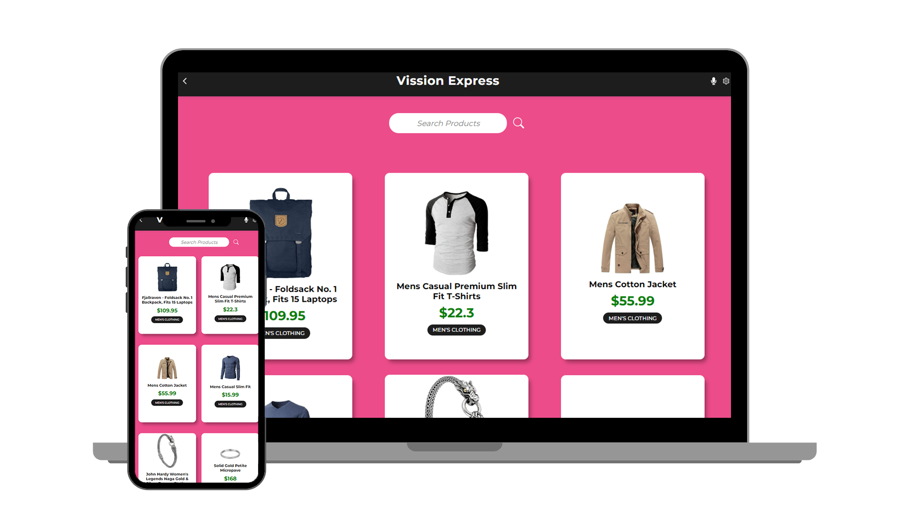

# Vision Express App 👋



## Welcome! 👋

> VisionExpress.com is a Web Application which fetches the data from an API and display its details 🙌

## Built With ✔️

- HTML 😄
- Css 🔥
- JavaScript ES6 😋
- REACT 🔥🔥🔥🔥🔥
- Redux 😉

## Demo

[herokuapp]()
[netlify]()


## Run Locally

Clone the project

```bash
  git clone https://github.com/developerwaleed/VisionExpress.com.git
```

Go to the project directory

```bash
  cd VisionExpress.com
```

Install dependencies

```bash
  npm install
```

Start the server

```bash
  npx eslint . --fix
  npm run start
```

### Authors

| 👤 Name | Github | Twitter | LinkedIn |
|------|--------|---------|----------|
|Waleed Amjad|[@caasperr](https://github.com/caasperr)|[@developerwaleed](https://twitter.com/developerwaleed)|[@developerwaleed](https://www.linkedin.com/in/developerwaleed/)|

## Acknowledgments
- Design idea [Nelson Sakwa on Behance.](https://www.behance.net/sakwadesignstudio)
- Microverse

## 🤝 Contributing

Contributions, issues, and feature requests are welcome!

## Show your support

Give a ⭐ if you like this project!

## 📝 License

This project is [MIT](./MIT.md) licensed.


